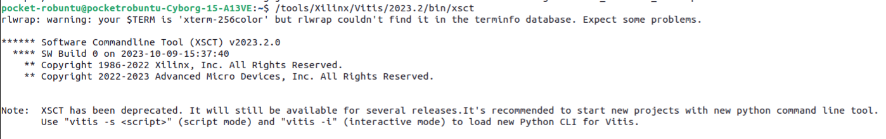
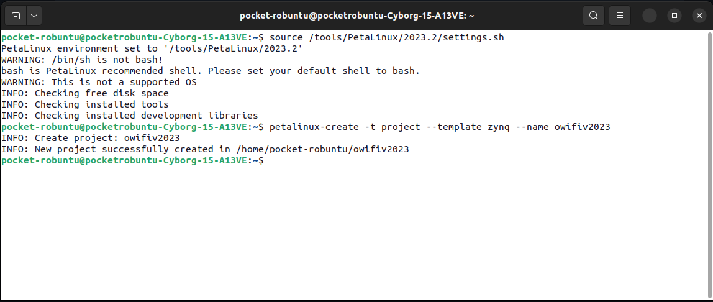
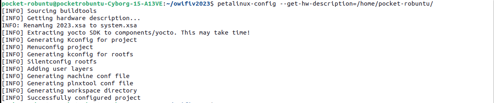

<h1>Personal Discovery on <a href="https://github.com/open-sdr/openwifi-hw/?tab=readme-ov-file#build-fpga">Building FPGA</a> with OpenWifi</h1>

This is my own discovery of how to perform actions from the <a href="https://github.com/open-sdr/openwifi-hw">open-sdr/openwifi-hw</a> README instructions for building FPGA. Many of the steps are in the wrong order and the file structure is wrong for migrating. Corrections are made on the OpenWifi(main branch) directory structure current for: 1.02.2025. If the developers of the openwifi project have made changes to their project, I am not responsible for the undesired actions of my sh file.

<h2>Instruction</h2>
<h3>Automated Method:</h3>

Run script (make sure it has permissions for launching) and enter values script asks for.

<code>./build_openwifi.sh</code>

Now you are done creating ip repo, continue steps from <a href="https://github.com/csshark/sdr-cap/blob/main/CORRECT%20readme%20from%20openwifi.md#vivado-setup">Vivado Setup

<h3>Manual Method:</h3>

Clone all required repositories:

<pre><code>git clone https://github.com/open-sdr/openwifi-hw.git && git clone https://github.com/open-sdr/openwifi.git && git clone && git clone https://github.com/open-sdr/openwifi-hw-img.git</code></pre>

After cloning <code>openwifi</code>, <code>openwifi-hw</code>, and <code>openwifi-hw-img</code>, it is necessary to visit <a href="https://github.com/analogdevicesinc/hdl/tree/f61d9707eb0a62533efd6facab59ab2444da94c9">analogdevicesinc/hdl</a>, find the <code>hdl_2021_r1</code> branch, and clone it into <code>/openwifi-hw/adi-hdl</code> directory using:

<pre><code>cd /openwifi-hw/adi-hdl/
git clone -b hdl_2021_r1 https://github.com/analogdevicesinc/hdl.git
# make sure to move all the subfolders and files into /adi-hdl directory  
</pre></code>

<h3>Example Structure:</h3>
<pre><code>openwifi-hw</code>
<code>|</code>
<code>|</code>
<code>L adi-hdl</code>
<code>      L docs</code>
<code>      L library</code>
<code>      L projects</code></pre>
  
<h2>Environment Variables</h2>

<pre><code>export XILINX_DIR=/tools/Xilinx
export BOARD_NAME=adrv9361z7035
</code></pre>

<b>NOTE:</b>If you want to migrate project to higher version afterwards, replace xilinx_dma.c with original xilinx_dma.c from <a href="https://github.com/Xilinx/linux-xlnx/tree/xlnx_rebase_v6.1_LTS/drivers/dma/xilinx">Xilinx</a> to openwifi/driver/xilinx_dma/. This method is provided in my <a href="https://github.com/csshark/sdr-cap/blob/main/build_openwifi.sh">automated building script</a>, so it's recommended to run .sh file via terminal.

<h2>Preparing Adi Libs</h2>

Now prepare Analog Devices HDL library:

<code>./prepare_adi_lib.sh $XILINX_DIR</code>

<h2>Building IP Cores</h2>

Navigate to <code>/openwifi-hw</code> and build IP cores first with <code>./get_ip_openofdm_rx.sh</code>

<pre><code>./get_ip_openofdm_rx.sh</code></pre>
<h2>Preparing board</h2>

<pre><code>./prepare_adi_board_ip.sh $XILINX_DIR $BOARD_NAME</code></pre>

<h2>Generating IPcores</h2>

<pre><code>cd openwifi-hw/boards/$BOARD_NAME/
../create_ip_repo.sh $XILINX_DIR
</code></pre>

<h2>Vivado Setup</h2>

In Vivado 2021.1 in the Tcl console:

<pre><code>source ./openwifi.tcl
# wait for Vivado to finish building and generate bitstream.
</code></pre>

Now verify project by running

<pre><code>cd openwifi-hw/boards
./sdk_update.sh $BOARD_NAME $OPENWIFI_HW_IMG_DIR
</code></pre>

<h3>Upgrading to a higher version:</h3>
<b>Note</b>: Upgraded image is intended for development and does not include rootfs with scripts provided by <a href="https://github.com/open-sdr/openwifi-hw">OpenWifi</a>. To get rootfs make bootable micro SD card from prepared <a href="https://drive.google.com/file/d/1vfkIr7T_DLN2Nw3YSG49BC3wCzOfxqd2/view"/>image</a>.

Build Project on Higher version of Vivado and do autoupgrading of IPcores. I highly recommend to check meta-adi repository before targeting <code>master</code> branch. You can additionally use <a href="https://github.com/csshark/sdr-cap/blob/main/VivadoComparer.sh">VivadoComparer.sh</a> to verify what changed in new relese and what should you rebuild manually. Here is where manual actions need to be taken or alternatively perform second method of migrating by ADI Reference Design (but try to adjust project manually first, it takes a few modifications). For me latest Vivado and adi release doesn't work well, so I recommend to chose version 2023.2.

<h1>Build Petalinux</h1>

<b>Note:</b>Instruction is tested only on ADRV9361-Z7035-BOB platform, this document follows steps required to build petalinux on specified platform required for SDR-CAP.

If you want to generate devicetree out of Petalinux (optional, can skip this part):

<pre><code>/path/to/your/Vitis/bin/xsct</code></pre>

Use three commands for xsct 2023.2 Tool:

<pre><code>sdtgen set_dt_param -board_dts /path/to/board_interface_preferences.xml #usually it's in Vivado/20xx.x/data/board_interface_preferences.xml
sdtgen set_dt_param -dir /path/to/output/dir #here output products are gonna be generated
sdtgen set_dt_param -xsa /path/to/xsa #ex: /home/user if xsa is stored in user directory
sdtgen gen_sdt
</code></pre>

Now prepare to build petalinux:

From your home location clone:

<pre><code>git clone -b 2023_R2 https://github.com/analogdevicesinc/meta-adi.git</code></pre>

And source Petalinux Tools:

<pre><code>source /path/to/petalinux/settings.sh</code></pre>

Petalinux CLI should appear.

As shown on the screenshot above it is time to create petalinux project. For this purpose use command: <code>petalinux-create -t project -n yourprojectname --template zynq
</code>

Now get into project configuration by typing: <code>petalinux-config --get-hw-description=/path/to/xsa</code>.
You can specify a folder where xsa is located, peta will find it automatically, but if selected directory contains another .xsa files specify .xsa file in command above.

In configuration  ensure that you:

<pre>
Added user layers in Yocto Settings [/home/yourusername/meta-adi/meta-adi-xilinx].
Set Filesystem to SD (EXT4,BOOT).
Changed Yocto MACHINE NAME to "zynq-adrv9361-z7035-bob".
Other Settings kept as they were.
</pre>

<b>Important! </b>echo the correct dtsi file to the config file like in <a href="https://github.com/analogdevicesinc/meta-adi/blob/main/meta-adi-xilinx/README.md"> meta-adi-xilinx</a>instructions.

<pre><code>echo "KERNEL_DTB=\"zynq-adrv9361-z7035-bob\"" >> project-spec/meta-user/conf/petalinuxbsp.conf</code></pre>

Afterwards generate device tree:

<pre><code>cd build
petalinux-build -c device-tree
</code></pre>

When all the steps have been done flawlessly, follow this command and go make yourself a coffee or two (this process takes a while):

<pre><code>petalinux-build
</code></pre>

If the overall progress percentage reached over 99% (it is usually when rootfs is being built) it usually means your boot image will be correct.

<h2>Generate Petalinux bootable image</h2>

Use customized bash script. Remember to match your .xsa file name and to reach .elf

<code>./gen_boot_bin.sh /path/to/system.xsa /path/to/u-boot.elf scriptboot</code>

This bash file is not officially mentioned by openwifi authors in documentation. Since u-boot and system.xsa are in the same directory, there is no need to specify path. For guide how to start with manually built OpenWifi image visit: <a href="https://github.com/open-sdr/openwifi/blob/master/doc/img_build_instruction/kuiper.md">kurpier.md</a> from openwifi.

The last step is to prepare BOOT and rootfs(EXT4) partitions on your SD card  and project is finally migrated to 2023.2 release.

If you want to use your own scripts and tools on user space they will have to be compiled (.c drivers and make recommended).

